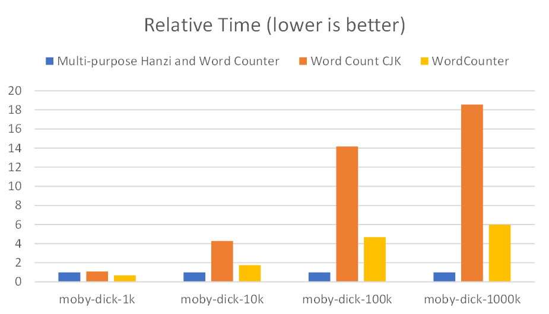
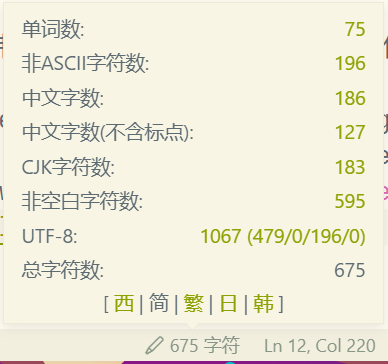
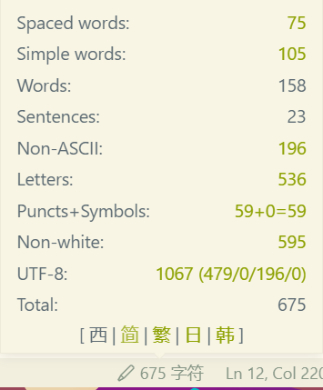
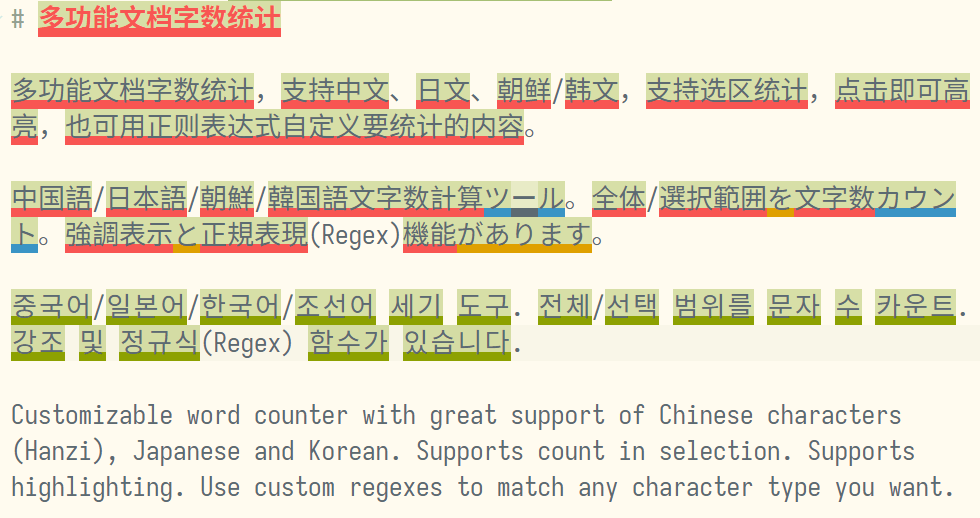

# 多功能文档字数统计

多功能文档字数统计，支持中文、日文、朝鲜/韩文，支持选区统计，点击即可高亮，也可用正则表达式自定义要统计的内容。

中国語/日本語/朝鮮/韓国語文字数計算ツール。全体/選択範囲を文字数カウント。強調表示と正規表現(Regex)機能があります。

중국어/일본어/한국어/조선어 세기 도구. 전체/선택 범위를 문자 수 카운트. 강조 및 정규식(Regex) 함수가 있습니다.

Customizable word counter with great support of Chinese characters (Hanzi), Japanese and Korean. Supports count in selection. Supports highlighting. Use custom regexes to match any character type you want.

**[中文介绍](#中文介绍--chinese-description)** / **[English description](#english-description--英文介绍)**

# 中文介绍 / Chinese Description

## 功能简介

刚安装扩展时，状态栏的右下角会出现一个铅笔的图标，显示字数（需要打开文本文件），鼠标移动到上面会弹出选择语言，请点击你想要显示的语言。下方的工具条也可以随时切换语言。点击「设为默认」可以将对应页面设为默认页面。

在状态栏上显示文档字数，鼠标移动到字数上，会显示详细统计信息。所有内容均可自定义。

点击对应项目的数字可以高亮匹配的文字，在编辑器右边的滚动条上也会标记出匹配文字所在的位置。

该扩展使用正则表达式匹配各类文字，可以在设置中自定义。

状态栏显示默认在右边，也可以在设置里更改。

## 对比其他扩展

**不卡顿，性能好**

统计结果按行缓存，不会因为字数很多就变卡顿。以下是与其他扩展的速度对比([详情](comparison.md#性能对比))。

为了便于在图片上表示，将该扩展耗费时间全部归一化。实际上字数多了该扩展花费的时间也会变多一些，但是增长相对其他扩展很小。

**支持多语言：中日韩**

默认配置有英简繁日韩，内容符合对应语言用户所需

**结果正确，符合直觉**

正确地统计字数做起来比听起来难。本扩展使用 Unicode 属性决定字符属于哪类；使用现代 JavaScript 分词 API `Intl.Segmenter` 处理组合字和组合符号。对各国文字、emoji 兼容性都极佳！

作者不会日语和(朝鲜语/韩语)，但是这些语言字数统计是准确的。（[详情](comparison.md)）

**点击即可高亮**

无论如何也找不到文档中的某个非 ASCII 字符在哪？只需点一下，就可以把它高亮出来。也是方便的文字类型可视化工具。

**可自行魔改**

作者「金毛」认为每个工具都应该留下足够大的魔改空间，总有一些深度用户有极强的改造力和控制力。因此，本扩展可以自行添加正则表达式匹配你想要的几乎任何东西，并用 JavaScript 函数模板控制显示内容！([配置教程](config-guide.md))

**可在 Web 版中运行**

本扩展不依赖于 nodejs 或某个特定平台，在浏览器环境下的 [VS Code for the Web](https://vscode.dev/) 中也能运行。

# English Description / 英文介绍

## Basic Introduction

After installing, a pencil icon and character count will appear in the right area of status bar. Pointing at it will reveal a small pop-up window containing a language selection interface. Click the language you want it to show in. The bottom bar of the small window can also be used to change language temporarily. Press `Set as default` to set current page as the default page.

It will show document character count on the status bar. Pointing at it will reveal detailed statistics. All items in it can be customized.

By clicking on numbers, it will highlight respective text, the position of text will also be shown on the scrollbar at right of the text editor.

This extension uses Regular Expression to match any type of character. It can be customized in the configuration.

The status bar item is at right side by default, but you can change it to left in the settings.

## Comparison with other extensions

**No lags, good performance**

The statistics result is calculated and cached per line. It won't lag because of very long text.

This is comparison of time spent to other extensions: ([More info](comparison.md#性能对比))。

To make the image prettier, the time spent of this extension is unified. However, the time will increase with more text, but it's much less time compared to other extensions.

**Multiple languages including Chinese, Japanese, and Korean**

The default configuration includes English (Western languages), Simplified and Traditional Chinese, Japanese, and Korean. The items shown is considered as relevant to the language user.

**Proper and intuitive result**

It's harder to count words correctly than it seems. This extension uses Unicode properties to decide which type the character belongs to. It also uses modern segmentation JavaScript API `Intl.Segmenter` to process combined characters and symbols. Greatly supports multiple scripts and emoji!

The author hasn't learned Japanese and Korean language, but the results are correct. ([More details](comparison.md))

**Click to highlight**

Can't find out where the non-ASCII character is? Only a click to highlight it. It's also a convenient tool to visualize character types.

**Hackable by user**

*geezmolycos*, the author, believes that every tool should leave some free space to be modified and hacked. There are always some users who have strong desire to change and controll things around them. Therefore, you can add custom regex to match anything that you want, and change display text with JavaScript function as template! ([Configuration guide](config-guide.md))

**Works in the web version**

The extension doesn't rely on NodeJS or a specific platform. It can run in [VS Code for the Web](https://vscode.dev/).
