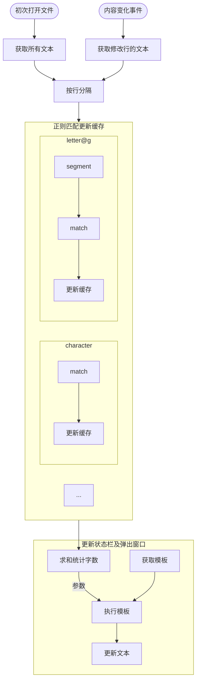

# 多功能字数统计扩展配置教程

该扩展的所有配置都在设置界面中的 `Extensions / Hanzi Counter` 里面。

## 基本配置

**`Status Bar: Enabled`**

启用或禁用状态栏上显示的字数统计。(可给每个编程语言指定不同设置)

**`Status Bar: Alignment`**

将状态栏显示的字数统计放到左边还是右边。

**`Status Bar: Priority`**

状态栏显示的优先级，右边显示行列数、空格、编码的那些项目的优先级是`100`，默认是`105`。

**`Template: Status Bar Template Name`**

名字必须是 `Counter: Template` 里面 `Item` 列的其中一个。控制状态栏中显示的模板。(可给每个编程语言指定不同设置)

**`Template: Tooltip Template Name`**

名字必须是 `Counter: Template` 里面 `Item` 列的其中一个。控制弹出的窗口中显示的模板。(可给每个编程语言指定不同设置)

**例：只给纯文本和 Markdown 启用**

首先，在设置中搜索 `@id:vscode-hanzi-counter.statusBar.enabled`，将 `Status Bar: Enabled` 禁用，这样会让扩展全局禁用。其次，再搜索 `@lang:plaintext @id:vscode-hanzi-counter.statusBar.enabled`，将其启用（如果已经勾选，就先取消再勾选，左侧就会多一条竖线），这样就启用了纯文本的字数统计。启用 Markdown 的字数统计，只需搜索 `@lang:markdown @id:vscode-hanzi-counter.statusBar.enabled`。

## 添加和删除显示的项目

> Q: 弹出窗口显示的东西太多了，看不过来怎么办？\
> Q: 我不想让它显示xxx的字数。

- 找出将你现在使用的模板名字，查看设置 `Template: Tooltip Template Name` 寻找该项名字对应的模板
- 例如该项是 `zh-hans`，则将 `Counter: Templates` 中的 `zh-hans` 项复制出来
  - 点击该行设置右边的铅笔图标，再用<kbd>Ctrl+A</kbd>全选复制
- 粘贴到新建文本文件中，按<kbd>Alt+Z</kbd>开启自动换行
- 例如要删除 `非ASCII字符`，则找到 `+ this.tableRow('非ASCII字符:', nonascii, '"nonascii"')` 并删除
- 将编辑後的内容重新粘贴到对应的设置项中
- 重启 VS Code，如果没有报错，就可以正常使用了

> Q: 我不想在状态栏上显示总字符数，我想显示中文字数。\
> Q: 我想让状态栏上显示其他东西。

- 找出你现在使用的状态栏模板名字，查看设置 `Template: Status Bar Template Name` 寻找该项名字对应的模板。
- 例如该项是 `status-bar-zh`，则将 `Counter: Templates` 中的 `status-bar-zh` 项复制出来
  - 点击该行设置右边的铅笔图标，再用<kbd>Ctrl</kbd>+<kbd>A</kbd>全选复制
- 粘贴到新建文本文件中，按<kbd>Alt</kbd>+<kbd>Z</kbd>开启自动换行。
- 观察最後的 `return` 语句之後的内容，类似 ``return `$(pencil) ${this.numberWithCommas(character)} 字符`;}``
- 将 `character` 更改为想要的正则表达式id（例如 `han`），`字符` 两个字修改成你想要的描述
- 将编辑後的内容重新粘贴到对应的设置项中
- 重启 VS Code，如果没有报错，就可以正常使用了

## 扩展基本工作流程

打开文件或更新字数时，会按行更新每个正则匹配字数的缓存，再得到统计结果，最后执行模板，获得最终显示文本。

## 正则表达式表

正则表达式表位于设置项 `Counter: Regexes` 中。每条正则表达式均有一个名字，名字不重复。在此添加的正则表达式的名字中的 `id`，可以作为[模板中的变量](#模板表)。

正则表达式的名字组成是 `<id>` 或 `<id>@[gws]<locale>@<nf>` 其中 `<id>` 为模板中可用的变量名。若采用包含 `@` 的形式，第一个 `@` 后的内容表示分段信息，第二个 `@` 后的内容表示标准化信息。两部分可以只有一部分，如果只想标准化，不想分段，则可以省略中间内容，直接在两个相连的 `@` 后写标准化形式名。标准化形式名可以是 `NFD` `NFC` `NFKD` `NFKC` （不区分大小写）。

文字在用正则表达式匹配之前，如果指定了标准化形式，会先使用 `string.normalize` 方法将待匹配文字标准化为对应的 Unicode 标准化形式。如果还指定了分段方式，还会按以下方法用 `Intl.Segmenter` 分段：

- 删除原字符串中所有 `U+FDD0`-`U+FDEF` 字符
- 由 `[gws]` 和 `<locale>` 获取[分段器的参数](https://developer.mozilla.org/en-US/docs/Web/JavaScript/Reference/Global_Objects/Intl/Segmenter/Segmenter#parameters)。`g`、`w`、`s` 分别代表 `granularity` 为 `grapheme`、`word`、`sentence`。`<locale>` 代表 `locales` 参数，也可以省略不写。
- 调用 `segmenter.segment` 进行分段
- 每段依据属性，若 `isWordLike`，在之前增加 `U+FDD1`，否则增加 `U+FDD0`，将所有段重新连接成字符串

这样，正则表达式只需统计其中的 `U+FDD0` 和 `U+FDD1` 的个数，就能获取有多少个段的信息，还可以通过更复杂的表达式匹配更精细的内容。

正则表达式启用了 `u` flag，推荐使用 [Unicode 属性匹配](https://developer.mozilla.org/en-US/docs/Web/JavaScript/Guide/Regular_Expressions/Unicode_Property_Escapes)，这样结果更加准确，浅显易懂。可以参考默认设置中的项目。也给出一个示例，这是默认设置里匹配汉字的正则表达式：

`(?=\p{scx=Han})(?=\p{L}|\p{Nl}).`

首先是一个「与」的结构，`(?=<AND1>)(?=<AND2>).`，其中前者匹配 `Script_Extensions` 包括 `Han` （汉字）的字符，後者匹配 `General_Category` 为 `Letter` 或 `Letter Number` 的字符。

## 模板表

模板表位于设置项 `Counter: Templates` 中，每一项表示一个模板。模板会转换成 Javascript 的函数，最后产生显示的文本。模板有两种格式：

- 代码块格式：模板内容由 `{` 开始，由 `}` 结束
- 表达式格式：不是代码块格式的，就是表达式格式

代码块格式，其函数体就是 `{...}` 中包含的内容，而表达式格式，函数体等同于 `return ...`

模板转化为 Javascript 函数时，其参数表就是上述正则表达式表的所有 `id`。因此，其中可以使用上述正则表达式的 `id` 作为变量。模板转换的函数需要返回的值，就是显示在状态栏或弹窗中的字符串，该字符串使用 VS Code 的 [`MarkdownString`](https://code.visualstudio.com/api/references/vscode-api#MarkdownString)，可以用 Markdown 语法。

**例：获取空白字符数**

首先，在 `Counter: Regexes` 中创建一个名为 `my_white` 的正则项，内容为 `\s`。其次，在 `Counter: Templates` 中创建一个 `my_template`，内容为`` `空白字符数：${my_white}` ``（注意两边的反引号，这是 ES6 的模板字符串），或``"空白字符数：" + my_white``，最后将 `Template: Tooltip Template Name` 修改成 `my_template` ，然后重启 VS Code 即可。

鼠标指针指向状态栏的显示，弹窗中就会出现如 `空白字符数：87` 的文字。

### 调用命令

为了方便实现用户交互和高亮功能，可以在模板中加入命令链接调用指定命令，可用的命令包括：

**`vscode-hanzi-counter.highlight`**

在正在编辑的文本文档中高亮若干个正则表达式（可选择颜色）

参数为 URL Encoded 的 json。参数有以下几种格式：

- `"w"`:\
  单个字符串，高亮对应 id 的正则表达式
- `["w", "r", "o", "y", "g", "b", "p"]`:\
  7个元素的字符串列表，设置高亮下划线标记的颜色，7个位置均为正则 id，其颜色分别为白、红、橙、黄、绿、蓝、紫。字符串可以为空，表示不高亮此颜色
- `[["w"], ["r"], ["o"], ["y"], ["g"], ["b"], ["p"]]`:\
  7个列表组成的列表，每个列表可以包含多个字符串，也可以没有字符串，可以把多个正则匹配都高亮为同一颜色

**`vscode-hanzi-counter.changeTooltip`**

改变弹出窗口所用的模板。

参数为 URL Encoded 的 json。参数有两个：第一个是单个字符串，为模板名称；第二个是 Boolean 值，表示是否保存到配置文件。

如：`` `[Set English as default](command:vscode-hanzi-counter.changeTooltip?${encodeURIComponent('["western", true]')})` ``

**例：高亮空白字符**

遵循上节中的获取空白字符数例子，编写模板如下

`` `空白字符数：[${my_white}](command:vscode-hanzi-counter.highlight?${encodeURIComponent('[[[], [], [], [], [], ["my_white"], []]]')})` ``

注意要多加一层方括号，因为本身传参数就是一个列表。

数字会变成绿色，点击即可高亮对应字符，例子中会给空白字符加蓝色下划线。也可以在右侧滚动条位置看到高亮的颜色。

### 环境空间

所有的模板函数均共享同一个环境空间 `this`，使用者可以自行在其中存储变量。其中自带几个变量

- `regexes`: 正则表达式表，类型为 `Map<string, RegExp>`
- `templates`: 模板列表，类型为 `Map<string, Function>`
- `templateParamaters`: 传入模板函数的参数名列表
- `segmenters`: 分段器表，类型为 `Map<string, Intl.Segmenter | undefined>`
- `count`: 计数结果，为`Map<string, number?>`
- `defaultTooltipTemplateName`: 目前配置文件中的默认模板名称

状态栏模板会最先执行，因此可以通过状态栏模板初始化需要的变量和函数等。

## Grapheme cluster boundary 和 Word boundary 规则说明

Unicode grapheme cluster 是书写系统中[公认的「字符」](http://utf8everywhere.org/#characters)的[一种近似](https://unicode.org/reports/tr29/)。有组合符号的字符，虽然组合符号是多个 codepoints，但是整体是一个 grapheme cluster。

Unicode 网站上有提供 [grapheme cluster 和 word 的规则](https://unicode.org/reports/tr29/)，javascript 中自带有 [`Intl.Segmenter`](https://developer.mozilla.org/en-US/docs/Web/JavaScript/Reference/Global_Objects/Intl/Segmenter) 用来将文本分隔为 grapheme cluster 和 word 的。该扩展利用了该API进行指定语言的分词分句，详情请参考上文。

## 带标点符号和不带标点符号的说明

「带标点符号」需要标点符号前方或後方有该项对应的文字。例如带标点符号的中文，那么标点符号必须和中文相邻，或前面只有标点符号，再前面是中文。数字在此语境下也算标点符号。

例如：

- `按M，安轨。`，两个符号都算
- `美国圣地亚哥，American，Shengdiyage。`，只有第一个逗号算
- `请打免费电话：0800-092-000。`，后面的符号和数字都算
